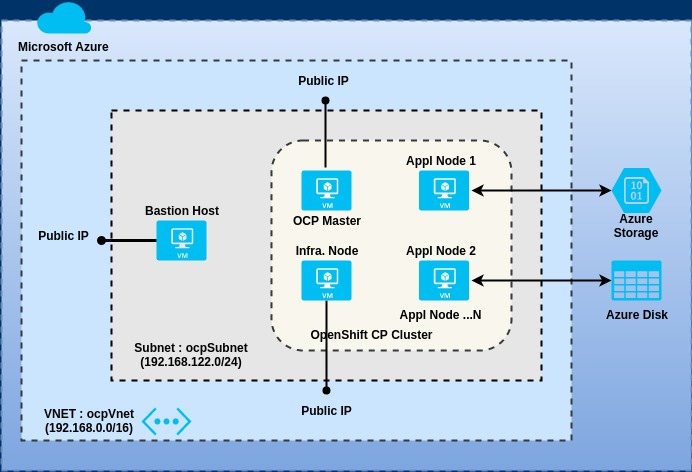

## Deploy Redhat OpenShift CP 3.9+ on Microsoft Azure
Use the artifacts in this project to deploy a multi-node non-HA OpenShift CP cluster on Azure.  For deploying a production grade highly available OpenShift CP cluster on Azure, refer to this [Microsoft GitHub](https://github.com/Microsoft/openshift-container-platform) project.

**Deployment Topology**



**Prerequisites**
- [Azure CLI 2.0](https://docs.microsoft.com/en-us/cli/azure/install-azure-cli?view=azure-cli-latest) installed on a workstation/PC 
- An Azure user account with "Owner" role permissions at the **Subscription** level.
- Access to a Windows or Linux terminal window.  You **must** be logged into to your Azure account via the CLI before proceeding with the next steps.

This project assumes readers have prior experience installing Red Hat OpenShift Container Platform and/or have gone thru the installation chapters in the OpenShift documentation.  As such, OpenShift exposes multiple parameters (Ansible variables) for configuring different sub-systems and various aspects of those sub-systems.  To review and/or get a deeper understanding of all the configuration options, refer to the **Installing Clusters** chapter in the [OpenShift Documentation](https://docs.openshift.com/).

**A] Deploy a *non-HA* OpenShift Cluster**
1. Fork this [GitHub repository](https://github.com/ganrad/ocp-on-azure) to your GitHub account.  Open a terminal window on your PC and clone this repository (see below).  Make sure you are using the GitHub URL of your forked repository.  
```
# Clone this GitHub repository.  Substitute your GitHub account ID in the command below.
$ git clone https://github.com/<Your-GitHub-Account>/ocp-on-azure
```
In case you haven't already generated an SSH key pair, do so now.  SSH keys will be used to authenticate and login to the Linux VM's.
```
# Generate an SSH key pair (private and public keys)
$ ssh-keygen -t rsa -b 2048
```
Switch to the `ocp-on-azure` directory.
```
# Switch directory
$ cd ocp-on-azure
```
There are two options for provisioning the infrastructure resources on Azure.  Use one of the options below.

  - **Option A:** Review and update the following variables in the script ``scripts/provision-vms.sh`` as necessary.  See below.

    VAR NAME | DEFAULT VALUE | DESCRIPTION
    -------- | ------------- | -----------
    OCP_RG_NAME | rh-ocp39-rg | Name of the Azure Resource Group where the OpenShift Cluster resources will be deployed
    RG_LOCATION | westus | Region (name) where the IaaS resources should be provisioned eg., eastus, centralus, westus ...
    RG_TAGS | CreatedBy=[Login Name] | Space separated tags in '[name=value]' format. These tags are assigned to the resource group.
    KEY_VAULT_NAME | ocpKeyVault | Name of the key vault to store SSH private key
    IMAGE_SIZE_MASTER | Standard_B2ms | Azure VM Image Size for OpenShift master nodes
    IMAGE_SIZE_INFRA | Standard_B2ms | Azure VM Image Size for Infrastructure nodes
    IMAGE_SIZE_NODE | Standard_B2ms | Azure VM Image Size for Application nodes
    VM_IMAGE | RedHat:RHEL:7-RAW:latest | Operating system image for all VMs
    BASTION_HOST | ocp-bastion | Name of the Bastion host
    OCP_MASTER_HOST | ocp-master | Name of the OpenShift Master host
    OCP_INFRA_HOST | ocp-infra | Name of the OpenShift Infrastructure host
    VNET_RG_NAME | rh-ocp39-rg | Name of the Azure Resource Group of virtual network when VNET_CREATE is set to 'No'
    VNET_CREATE | Yes | **Empty:** VNET and Subnet resources must exist in resource group **VNET_RG_NAME**.  These resources will not be created.  **Yes:** VNET and Subnet resources in the resource group specified by **OCP_RG_NAME** will be created.  The values specified in both OCP_RG_NAME and VNET_RG_NAME must be the same.  **No:** A subnet in an existing virtual network specified by **VNET_NAME** in resource group **VNET_RG_NAME** will be created.  Both VNET resource group and virtual network should already exist.
    VNET_NAME | ocp39Vnet | Name of the VNET
    VNET_ADDR_PREFIX | 192.168.0.0/16 | Network segment for virtual network
    SUBNET_NAME | ocpSubnet | Name of the subnet
    SUBNET_ADDR_PREFIX | 192.168.122.0/24 | Network segment for subnet where all OpenShift node VM's will be provisioned
    OCP_DOMAIN_SUFFIX | devcls.com | Domain suffix for node hostnames in the OpenShift cluster (cluster node hostnames)

    After updating `provision-vms.sh`, run the script in a terminal window.  This shell script will provision all the Azure infrastructure resources required to deploy the OpenShift cluster.
    ```
    # Run the script 'scripts/provision-vms.sh'.  Specify, no. of application nodes to deploy in cluster.
    $ ./scripts/provision-vms.sh <no. of nodes>
    ```
    The script should print the following message upon successful creation of all infrastructure resources.
    ```
    All OCP infrastructure resources created OK.

    ```

  - **Option B:** Review the parameters (in the *parameters:* section) and their default values in the Azure ARM template file ``scripts/provision-vms.json``.  Update the parameter values in the file ``scripts/vms.parameters.json`` as necessary.

    Open a terminal window and run the following CLI command to provision all required infrastructure resources on Azure.
    ```
    # Deploy the ARM template `scripts/provision-vms.sh` using Azure CLI.  Substitute the correct value for the resource group.
    $ az group deployment create --verbose --resource-group rh-ocp310-rg --template-file ./scripts/provision-vms.json --parameters @./scripts/vms.parameters.json
    ```
    Upon successful execution of the ARM template, the following message should be printed in the output.
    ```
      "provisioningState": "Succeeded",
      "template": null,
      "templateHash": "7624771502800391155",
      "templateLink": null,
      "timestamp": "2018-08-10T21:05:50.389722+00:00"
    },
    "resourceGroup": "rh-ocp310-rg"
    ```

2. Retrieve the subscription ID for your Azure account.  Note down the values for **id** (Subscription ID) and **tenantId** (AD Tenant ID) from the command output.  Save the values in a file.
```
# Retrieve subscription info. for your Azure account
$ az account show
```

3. Create an Azure Service Principal (SP).  This SP will be used by the *Azure Cloud Provider* OpenShift plug-in to create persistent volumes dynamically.  In a later step, we will define a Kubernetes *Storage Class* object for Azure disk storage and configure it as the default storage provider for persistent volumes for the OpenShift cluster.
Specify appropriate values for **Subscription ID**, **Resource Group** and **SP Name** in the command below.  Make sure the SP Name is unique eg., [MTC Region]-OCP-Azure-SP-[Date]
```
# Create an Azure Service Principal.
$ az ad sp create-for-rbac --name <SP Name> --password Cl0udpr0viders3cr3t --role contributor --scopes /subscription/<Subscription ID>/resourceGroups/<Resource Group>
```
Save the output of the above command in a file.

4. Login to the Bastion host VM using SSH (Terminal window). Install *Ansible* and *Git*.
```
# Login to Bastion host via SSH.  Substitute the IP Address of the DNS name of the Bastion host.
$ ssh ocpuser@<Public IP Address / DNS name of Bastion Host>
#
# Install ansible
$ sudo yum install ansible
#
# Install git
$ sudo yum install git
#
$ ansible --version
$ git --version
```

In the terminal window connected to the Bastion host, clone this [GitHub repository](https://github.com/ganrad/ocp-on-azure).  Make sure you are using the URL of your fork when cloning this repository.
```
# Switch to home directory
$ cd
# Clone your GitHub repository.
$ git clone https://github.com/<Your-GitHub-Account>/ocp-on-azure.git
#
$ Switch to the 'ocp-on-azure/ansible-deploy' directory
$ cd ocp-on-azure/ansible-deploy/
```

6. Update `hosts` file with the IP Addresses (or DNS names) of all OpenShift nodes (Master + Infrastructure + Application).

7. Review `group_vars/ocp-servers` file and specify values for **rh_account_name**, **rh_account_pwd** & **pool_id** variables.  Also, specify the OpenShift CP and docker runtime versions in the **ocp_ver** and **docker_ver** variables respectively.

8. Update the ansible task script 'ansible-deploy/roles/install-ocp-preq/tasks/main.yml' in case you are planning to install OpenShift CP v3.9 or lower.  For installing OpenShift v3.9 or lower, package 'atomic-openshift-utils' needs to be installed on all nodes.  Open this script and search for the package by name.  Follow the instructions to install this package.

9. Check if Ansible is able to connect to all OpenShift nodes.
```
# Ping all OpenShift nodes.  You current directory should be 'ocp-on-azure/ansible-deploy' directory.
$ ansible -i hosts all -m ping
```

10. Run syntax check on ansible playbook.  If there are any errors, fix them before proceeding.
```
# Ensure you are in sub-directory 'ansible-deploy'.  If not, switch to this directory.
$ cd ansible-deploy
#
# Check the syntax of commands in the playbook
$ ansible-playbook -i hosts install.yml --syntax-check
```

11. Run the Ansible playbook `install.yml`.  This command will run for a while (~ 20 mins for 4 nodes).
```
# Run the Ansible playbook
$ ansible-playbook -i hosts -v install.yml
```
For each OpenShift node (VM), the `ansible-playbook` command should print a count of all tasks successfully executed (ok), changed and failed. If there are any **failed** tasks, re-run the playbook until all tasks are successfully executed on all nodes. Upon successful execution of all playbook tasks on all nodes, the following message will be printed in the output.
```
PLAY RECAP *********************************************************************************************************************************
ocp-infra.onemtcprod.net     : ok=14   changed=12   unreachable=0    failed=0   
ocp-master.onemtcprod.net    : ok=14   changed=12   unreachable=0    failed=0   
ocp-node1.onemtcprod.net     : ok=14   changed=12   unreachable=0    failed=0   
ocp-node2.onemtcprod.net     : ok=14   changed=12   unreachable=0    failed=0
```

12. Login via SSH to the OpenShift **Master** node (VM).  The OpenShift installer (Ansible playbook) should be run on this VM/Node.  Before proceeding with OpenShift installation, check the following -
- Make sure you are able to login to all nodes/VMs (Master + Infrastructure + Application) using SSH
- All nodes should be resolvable thru their DNS aliases within the VNET (ocpVnet)
- Passwordless **sudo** access should be configured on all nodes (VMs)
- For installing OpenShift CP v3.9 (or lower), download the Ansible hosts file (`scripts/ocp-hosts`) from the `ocp-on-azure` GitHub repository which you forked in a previous step.
- For installing OpenShift CP v3.10 (or higher), download the Ansible hosts file (`scripts/ocp-hosts-3.10`) from the `ocp-on-azure` GitHub repository which you forked in a previous step.

You can use **wget** or **curl** to download the Ansible hosts file.  See below.
```
# Download the ansible hosts file 'scripts/ocp-hosts-3.10'. Substitute your GitHub account name in the command below.
# Alternatively, if you are installing OpenShift CP v3.9 (or lower version), download the 'scripts/ocp-hosts' file.
$ wget https://raw.githubusercontent.com/<Your-GitHub-Account>/ocp-on-azure/master/scripts/ocp-hosts-3.10
```
Review the **ocp-hosts-3.10** file and update the hostnames for the OpenShift Master, Infrastructure and Application nodes (VM's).  Make other configuration changes as necessary.  Refer to the [OpenShift CP documentation](https://docs.openshift.com/) for details on configuring other sub-systems thru variables.  The provided script only installs a simple multi-node non-HA cluster with metrics sub-system enabled.  For installing and configuring other sub-systems such as logging, cloud provider plugins for persistent volumes, default storage classes etc, refer to the OpenShift documentation.

13. Run the OpenShift Ansible Playbooks as below.
- Run the `prerequisites.yml` playbook to run pre-requisite checks
```
# Run the 'prerequisites.yml' playbook to run pre-requisite checks. Specify the correct Ansible hosts inventory file.
$ ansible-playbook -i ./ocp-hosts-3.10 /usr/share/ansible/openshift-ansible/playbooks/prerequisites.yml
```
If all the checks pass, you should see the output as below.
```
PLAY RECAP *********************************************************************************************************************************
localhost                  : ok=11   changed=0    unreachable=0    failed=0   
ocp-infra.onemtcprod.net   : ok=60   changed=14   unreachable=0    failed=0   
ocp-master.onemtcprod.net  : ok=74   changed=15   unreachable=0    failed=0   
ocp-node1.onemtcprod.net   : ok=60   changed=14   unreachable=0    failed=0   
ocp-node2.onemtcprod.net   : ok=60   changed=14   unreachable=0    failed=0
```
- Next, run the `deploy_cluster.yml` playbook to deploy the OpenShift cluster.  This cluster deployment script should run for approximately 30-40 minutes (~ 4 nodes).
```
# Run the 'deploy_cluster.yml' playbook to deploy the OpenShift cluster
$ ansible-playbook -i ./ocp-hosts-3.10 /usr/share/ansible/openshift-ansible/playbooks/deploy_cluster.yml
```
When the Ansible playbook run finishes, the output should list the status of all executed tasks.  See below.  For OpenShift CP v3.9 (or lower version), you will see a slightly different output.
```
PLAY RECAP *********************************************************************************************************************************
localhost                  : ok=15   changed=0    unreachable=0    failed=0   
ocp-infra.onemtcprod.net   : ok=119  changed=57   unreachable=0    failed=0   
ocp-master.onemtcprod.net  : ok=807  changed=327  unreachable=0    failed=0   
ocp-node1.onemtcprod.net   : ok=119  changed=57   unreachable=0    failed=0   
ocp-node2.onemtcprod.net   : ok=119  changed=57   unreachable=0    failed=0   


INSTALLER STATUS ***************************************************************************************************************************
Initialization              : Complete (0:00:23)
Health Check                : Complete (0:02:10)
Node Bootstrap Preparation  : Complete (0:18:59)
etcd Install                : Complete (0:01:35)
NFS Install                 : Complete (0:00:24)
Master Install              : Complete (0:05:30)
Master Additional Install   : Complete (0:02:10)
Node Join                   : Complete (0:03:48)
Hosted Install              : Complete (0:01:04)
Web Console Install         : Complete (0:00:35)
Metrics Install             : Complete (0:03:10)
Service Catalog Install     : Complete (0:02:10)
```
If there are any tasks in failed state, review the exception messages, update the playbook (`install.yml`) and re-run the playbook.

14.  OpenShift Web Console can be accessed @ - `https://<OpenShift Master Public Hostname>/`

Substitute the DNS name of the OpenShift cluster **Master Node** in the URL above.

**B] Tearing down the OpenShift CP cluster**

After you are done using the OpenShift CP cluster, you can delete all Azure resources using Azure CLI or the [Azure Portal](https://portal.azure.com).  To delete all Azure resources using Azure CLI, refer to the command below.  Specify correct value for the Azure **Resource Group** name in the delete command.
```
# Delete the resource group and all associated resources.
$ az group delete --name <Resource Group name>
```
